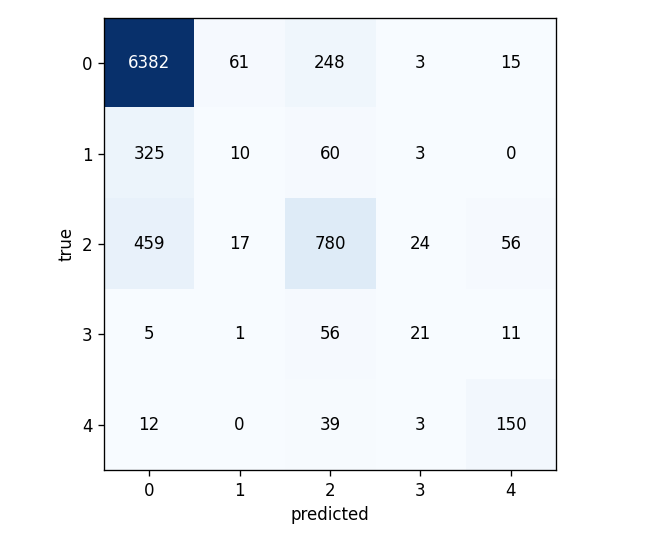
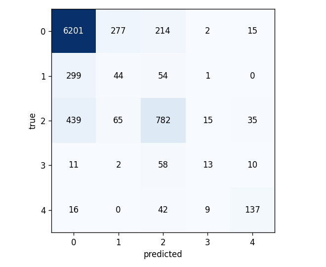
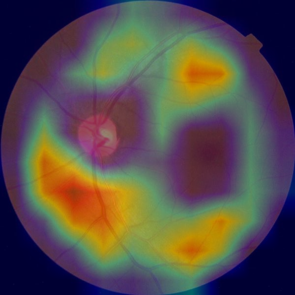
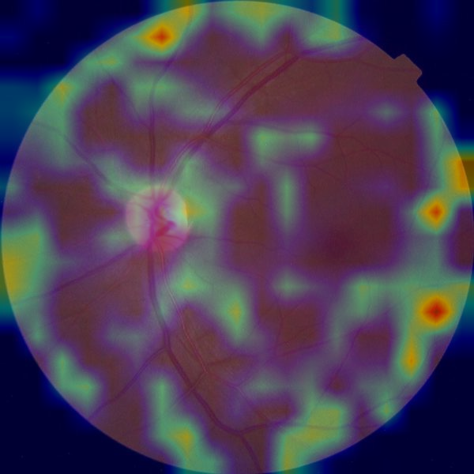
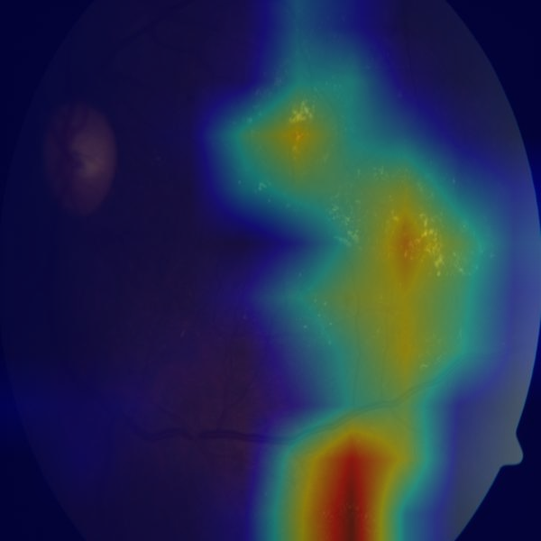
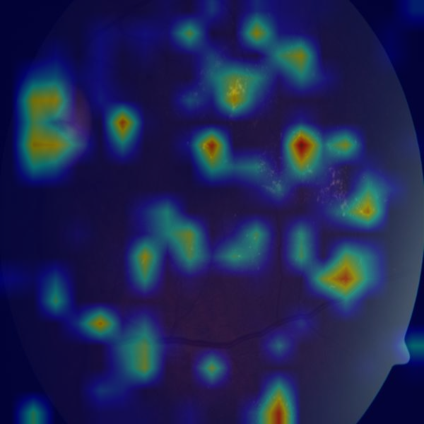
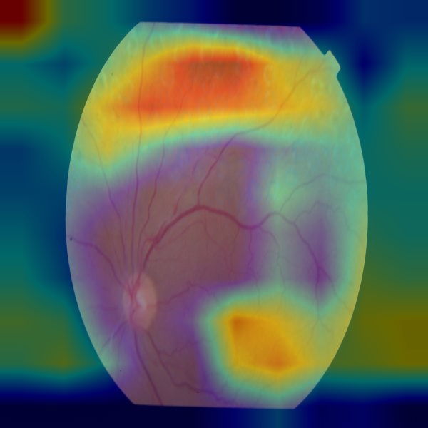
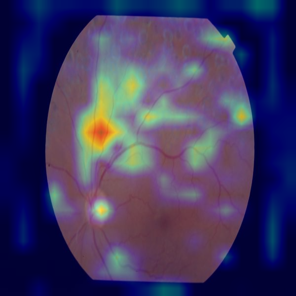
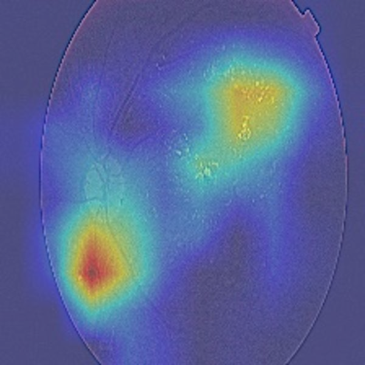
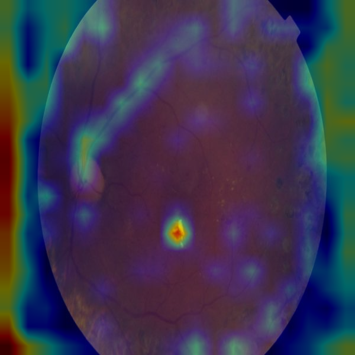

# Diabetic Retinopathy Grading — EfficientNet-B3

A 5-class diabetic retinopathy (DR) severity classifier for retinal fundus
photographs, with Grad-CAM explainability. Grades follow the international
clinical scale: 0 No DR, 1 Mild, 2 Moderate, 3 Severe, 4 Proliferative.

This is a research / portfolio implementation. It is **not** a medical device
and has not been cleared or approved by any regulatory body. The regulatory
notes below describe how the technical artifacts map to design-control
expectations, not a claim of compliance.

**License:** the code in this repository is [MIT licensed](LICENSE). That
does not extend to the training data — APTOS 2019 and EyePACS are each under
their own Kaggle competition terms — or to the ImageNet-pretrained weights
pulled via `timm`, which keep their original license.

**Landing page:** [lsaiko.github.io/Reti-dia-grad](https://lsaiko.github.io/Reti-dia-grad/) —
sample fundus photos next to their Grad-CAM overlays, one per grade, plus the
results table below.

## Results

Held-out test split (8,741 de-leaked original images), EfficientNet-B3.

| Metric | Frozen backbone (baseline) | Full fine-tune (discriminative LR) | + grade-1 class-weight boost |
|---|---|---|---|
| Quadratic Weighted Kappa (QWK) | 0.702 | **0.723** | 0.710 |
| Accuracy | 0.820 | 0.840 | 0.821 |
| Referable-DR (grade ≥ 2) sensitivity | 0.68 | 0.698 | 0.674 |
| Referable-DR (grade ≥ 2) specificity | 0.95 | 0.954 | **0.960** |
| Grade-1 (Mild) recall | 0.08 | 0.03 | **0.111** |
| Grade-1 (Mild) F1 | 0.09 | 0.04 | **0.112** |

Per-class F1 (grade-1 boost run): 0 No-DR 0.91 · 1 Mild 0.11 · 2 Moderate 0.63 ·
3 Severe 0.19 · 4 Proliferative 0.68.




QWK (quadratic-weighted Cohen's kappa) is the standard DR-grading metric — it
penalizes errors by how far off the grade is. The **baseline** trains only the
last two EfficientNet stages + head; frozen ImageNet features plateau at
QWK ≈ 0.70. Unfreezing the whole backbone with a **discriminative learning
rate** (`--no-freeze --lr 3e-4 --backbone-lr 3e-5`, 15 epochs) improved QWK,
accuracy, and referable-DR sensitivity — but **made grade-1 (Mild DR) worse**,
not better: recall dropped from 0.08 to 0.03 (only ~10 of 398 mild-DR eyes
correctly identified). The extra capacity appears to have gone toward the
majority/moderate classes rather than resolving the subtle grade-0/grade-1
boundary.

**Targeted fix:** the same fine-tune with grade-1's class weight manually
boosted ~4× beyond the "balanced" formula (`--boost-class 1 --boost-factor 4.0`,
pushing it to ~5.0 — higher than every other class) nearly triples grade-1 F1
over the unboosted fine-tune (0.04 → 0.112) and beats the baseline too
(0.09 → 0.112), at a cost of 0.013 QWK and 0.024 referable-DR sensitivity versus
the unboosted fine-tune. Training was unstable early (epoch 1 val QWK dropped
to 0.52 as the model over-corrected toward grade-1 at everyone else's expense)
before settling into this trade-off by epoch 5. None of the three models
reaches the 0.80 QWK target; see Limitations for what a further attempt would
need (oversampling, focal loss, or accepting the recall/QWK trade-off point
that fits the intended use).

## Dataset

A merged **APTOS 2019 + EyePACS** fundus-photo set (~90k source images graded
0–4), arranged as an `ImageFolder`:

```
<data_root>/
  train/{0,1,2,3,4}/*.jpg   # offline-augmented (multiple variants per source image)
  val/{0,1,2,3,4}/*.jpg
  test/{0,1,2,3,4}/*.jpg
```

- [APTOS 2019 Blindness Detection](https://www.kaggle.com/competitions/aptos2019-blindness-detection) — 3,662 images
- [EyePACS / Diabetic Retinopathy Detection](https://www.kaggle.com/c/diabetic-retinopathy-detection) — ~88k images

The label distribution is severely skewed: on un-augmented images **grade 0 ≈ 74%**,
grades 3–4 combined ≈ 3%. A model trained without addressing this collapses to
predicting grade 0 for everything — ~74% accuracy while being clinically useless.

**Split integrity.** The `train` set contains multiple offline-augmented copies of
each source photo. `data.py` (`make_loaders`, `make_eval_loader`) enforces two
things so metrics stay honest:
1. **de-leaking** — any val/test image whose source id also appears in `train` is
   dropped (the provided offline split shares ~8% of source images across splits);
2. **originals only** — val/test are restricted to the un-augmented image per
   source, so metrics aren't computed over correlated augmented duplicates.

### Reproducing on Windows

The dataset ships from a downloaded archive, so every file carries a
Mark-of-the-Web tag (`Zone.Identifier`). On-access malware scanners (Windows
Defender, NordVPN Threat Protection, etc.) re-scan MotW-tagged files on every
open — this throttled the dataloader to ~0.5 img/s until the tags were stripped
(`Get-ChildItem -Recurse | Unblock-File`). Strip the tags and/or add the dataset
folder to your scanner's exclusions before training.

## Approach

### Classification framing
DR grades are ordinal — grade 2 sits *between* grades 1 and 3. Two options:
5-class softmax (simple) or ordinal/cumulative-probability regression. This
implementation uses **softmax**, which is sufficient here; the QWK metric and
class weighting carry most of the ordinal signal in practice.

### Class imbalance
Class weights are computed with `sklearn.utils.class_weight.compute_class_weight("balanced", ...)`
from the training labels and passed to `CrossEntropyLoss(weight=...)`. This
raises the loss contribution of the rare referable grades (3, 4) so the model
cannot ignore them.

### Architecture
EfficientNet-B3 via `timm`, 300×300 input, ImageNet normalization. By default
the early stages are frozen and only the last two MBConv stages plus the head
are fine-tuned (`--no-freeze` trains everything). EfficientNet gives a better
accuracy/compute trade-off than a comparable ResNet for this task.

### Augmentation
On-the-fly Albumentations pipeline (train only): `Resize`, `CLAHE` (contrast
normalization for varying fundus-camera exposure), `RandomRotate90`,
`HorizontalFlip`, `CoarseDropout` (occlusion robustness), `Normalize`. This is on
top of whatever offline augmentation the dataset already carries.

### Training
Seeded, AMP (mixed precision), AdamW, cosine LR schedule over the epoch budget.
`train.py` writes `checkpoints/last.pt` every epoch and `checkpoints/best.pt` on
val-QWK improvement; re-run with `--resume auto` to continue an interrupted run.

### Explainability — Grad-CAM
`gradcam.py` implements Grad-CAM from scratch: forward/backward hooks on a
target conv layer, gradients global-average-pooled into channel weights,
weighted activation sum passed through ReLU, upsampled and normalized to a
`[0,1]` heatmap. `overlay_gradcam()` blends a jet colormap over the original
photo; `batch_overlay()` processes a folder into `results/`.

The intended use of the heatmaps is **interpretability review**: confirming that
predictions are driven by retinal features (microaneurysms, hemorrhages,
neovascularization, exudates) rather than image artifacts — lens flare, border
vignetting, JPEG blocking, or laser photocoagulation scars from prior treatment.
A model that grades correctly for the wrong reason will not generalize to a new
camera or clinic.

**Target layer: resolution investigation.** The natural default —
`model.conv_head`, the very last conv layer — is only 10×10 at 300×300 input,
so its heatmaps are a handful of coarse blocky regions upsampled 30×. On first
manual review (baseline choice, all five grades) heat was often concentrated
near the fundus border rather than clearly on vessels or lesions, which would
undercut the whole interpretability argument if it reflected the model's real
attention. To check, the same 10 sample images were re-run with the target
layer moved to `model.blocks[4]` — 19×19, ~3.6× the cells, one stage earlier
so slightly less class-specific but far less lossy when upsampled. The
difference was immediate and consistent: `conv_head` produces 3-4 giant blobs
that tend to hug the image edge; `blocks[4]` resolves into many small,
discrete hotspots that land on the optic disc, vessel arcades, and scattered
lesion-like points — visibly more clinically plausible, at the same compute
cost. **`model.py`'s `target_layer()` now defaults to `blocks[4]`**;
`target_layer_coarse()` keeps the old `conv_head` for comparison.

| | `conv_head` (10×10, old default) | `blocks[4]` (19×19, current default) |
|---|---|---|
| Grade 0 |  |  |
| Grade 2 |  |  |
| Grade 3 |  |  |
| Grade 4 |  |  |

Some heat still bleeds into the black corners outside the circular fundus
field in the `blocks[4]` overlays — consistent with the known CNN zero-padding
border artifact (elevated activations right at a conv layer's spatial edge,
independent of image content), not the model treating vignetting as pathology.
That artifact is a separate, lower-stakes issue from the original
border-concentration finding, which the resolution swap substantially
resolved. This was a genuine, if informal, investigation on 10 images across
5 grades with 1 checkpoint — not a systematic study — but the direction and
size of the effect were consistent enough to change the default rather than
just note the finding.

## Regulatory context (informational)

For software in a medical device, FDA design controls under **21 CFR Part 820.30**
require, among other things, design verification and **design validation** —
objective evidence that the device meets user needs and intended uses, and that
the design outputs meet the design inputs.

The artifacts in this repo map onto that framework as follows:

| Design-control element (21 CFR 820.30) | Artifact here |
|---|---|
| Design inputs | Intended use: 5-class DR severity from fundus photos; performance requirement stated as a QWK threshold |
| Design outputs | Trained model weights + the deterministic `predict.py` inference path |
| Verification (outputs meet inputs) | Held-out QWK, per-class accuracy, confusion matrix on a data split not seen in training |
| Validation (meets user needs / intended use) | Evaluation on data representative of the deployment population; Grad-CAM review that the model attends to pathology, not artifacts |
| Design history file | Version-controlled code, config, metrics, and the augmentation/label-handling decisions recorded above |

Grad-CAM specifically supports the validation argument: it produces the
per-case interpretability evidence a reviewer expects to see when assessing
whether an image model's decisions are clinically grounded. A real submission
would also require a locked dataset with documented provenance and grader
agreement, prospective or independent test data, subgroup performance analysis,
human-factors evaluation, and a full risk-management file (ISO 14971). None of
that is included here.

## Limitations

- **Grad-CAM heatmaps are a 10-image, 5-grade, 1-checkpoint informal review, not
  a systematic study.** Moving the target layer from `conv_head` to `blocks[4]`
  (see Explainability) fixed the initial border-concentration finding on that
  sample, but a residual conv-padding edge artifact remains, and localization
  still isn't lesion-tight even at 19×19. This is a sanity check that the
  model roughly attends to the right structures, not lesion-level evidence for
  a regulatory submission.
- **Merged, not curated, dataset.** Training data is APTOS 2019 combined with
  EyePACS, not a single source with one labeling protocol. The two sets were
  graded independently and were captured on different camera hardware and
  patient populations; merging them is a domain-shift risk that hasn't been
  measured or corrected for.
- **No external validation set.** Every number in the Results table comes from
  a held-out split of the *same* merged APTOS+EyePACS pool (de-leaked at the
  source-image level, see Dataset above). None of it is an independent dataset
  or a different clinic/camera population — the standard bar for a
  generalization claim in DR grading.
- **No subgroup analysis.** Performance has not been broken out by camera
  type, patient demographics, or image quality. The reported metrics are
  pooled averages and could mask large disparities across subgroups.
- **Grade 1 (Mild DR) is the model's weak point.** F1 is 0.09 (baseline) →
  0.04 (fine-tuned, capacity alone made it worse) → 0.11 (fine-tuned +
  4× class-weight boost) vs. 0.63–0.91 for every other grade even in the best
  case — see Results. A 4× manual weight boost roughly triples F1 back over
  the unboosted fine-tune, at a real cost elsewhere (0.013 QWK, 0.024
  referable-DR sensitivity), and the training dynamics were visibly unstable
  getting there (epoch-1 val QWK cratered to 0.52 before settling by epoch 5).
  The grade 0/1 boundary is a known-hard case in DR grading generally (subtle
  microaneurysms, high inter-rater disagreement in the literature); that
  capacity alone makes it worse while class weight alone only partially fixes
  it suggests label noise at this specific boundary in the merged dataset, not
  just a modeling shortfall. **Not fully resolved** — none of the three models
  hits the 0.80 QWK target, and the honest choice is between the unboosted
  fine-tune (higher QWK, worse at the class that matters most for early
  intervention) and the boosted one (the reverse), not a clean win.
- **Nonstandard split methodology.** `train` contains multiple offline-augmented
  copies per source image, and `data.py` de-leaks val/test against `train` and
  restricts them to original (un-augmented) images to keep metrics honest (see
  Dataset → Split integrity). This mitigates the main risk of augmented
  duplicates leaking across splits, but it's still a different, less-standard
  setup than a benchmark curated from the start with clean, fixed splits.
- **Not a cleared or approved medical device** — see the disclaimer at the top
  of this README and the "None of that is included here" caveat in Regulatory
  context above.
- **Single-model, single-run results.** No ensembling and no repeated-seed
  variance estimate. Each reported QWK and other point estimate comes from one
  training run and should be read as a single sample, not a stable mean.

## Conclusion

Three EfficientNet-B3 configurations were trained and evaluated on a common,
de-leaked test split: a frozen-backbone baseline, a full fine-tune, and the
fine-tune with grade-1's loss weight manually boosted. None reaches the 0.80
QWK target set at the start of this project. What emerged instead is a
concrete, measured trade-off: the unboosted fine-tune has the best aggregate
QWK (0.723) but is nearly blind to Mild DR (recall 0.03); the boosted version
gives up 0.013 QWK to make Mild DR detectable (recall 0.111, still far from
good). That grade-1 performance moves in opposite directions between "more
capacity" and "more targeted weight" — rather than both helping — points to
label noise or genuine visual ambiguity at the grade 0/1 boundary in this
merged dataset, not just an undertrained model. The project's default model
(`checkpoints_grade1fix/best.pt`) is the boosted one, chosen because a
screening tool blind to the mildest disease stage is a worse failure mode
than a few points of aggregate accuracy — but that is a stated judgment call,
not a solved problem, and `checkpoints_ft/best.pt` remains available for
whoever weighs it differently. The Grad-CAM investigation (below and in
Explainability) found and partially corrected a real methodological issue —
the original target layer's heatmaps were dominated by coarse, border-hugging
blobs — which is itself a useful result: the interpretability evidence this
kind of project relies on has its own failure modes and needs the same
skepticism as the accuracy numbers.

## Future work

Ranked by expected payoff per unit of additional effort, not by ambition:

1. **Ensemble the three existing checkpoints — no new training required.**
   Average the softmax outputs of `checkpoints/best.pt`, `checkpoints_ft/best.pt`,
   and `checkpoints_grade1fix/best.pt` (a straightforward addition to
   `predict.py`/`evaluate.py`: load all three, mean the probability vectors
   before `argmax`). Since the fine-tune and the boosted model make
   *different* mistakes — one favors aggregate QWK, the other favors grade-1 —
   averaging them is a well-established way to recover some of both without
   touching the grade-1/QWK trade-off's root cause. This is the one item here
   that could plausibly help "for free" and should be tried first.
2. **Temperature scaling** for calibrated confidence (already noted in
   Evaluation) — cheap, a few lines, doesn't touch accuracy.
3. **Focal loss in place of manual class-weight boosting.** The boost here was
   a blunt instrument (multiply one class's weight by a hand-picked constant).
   Focal loss down-weights *easy* examples adaptively regardless of class,
   which is a more principled way to force attention onto hard cases like the
   grade 0/1 boundary, and is a drop-in change to `train.py`'s criterion.
4. **A finer-grained or domain-pretrained backbone.** ImageNet pretraining is
   a mismatch for fundus photos; a backbone with self-supervised or
   supervised pretraining on retinal images (several public checkpoints
   exist for DR specifically) would likely lift every number here without
   architecture changes. Worth trying before assuming the ceiling is the
   dataset.
5. **An auxiliary lesion-segmentation head**, trained jointly if a
   pixel-annotated dataset (IDRiD, DDR) is brought in alongside APTOS+EyePACS.
   This is the one change here that could improve both classification *and*
   Grad-CAM quality directly, since it forces the backbone to represent
   lesions explicitly rather than hoping classification pressure alone
   produces lesion-aligned features — but it's real scope: a new dataset, a
   new loss term, and multi-task training.
6. **Independent external validation** on a held-out clinical population or
   camera type not represented in APTOS/EyePACS — the only way to know if any
   of these numbers generalize past this specific merged dataset. Needed
   before any of this is more than a portfolio exercise.
7. **Ordinal-regression head (CORAL / cumulative-logits)** in place of
   5-way softmax — theoretically better suited to graded severity, but the
   grade-1 experiments here suggest the bottleneck is label quality at one
   specific boundary, not the loss framing, so this is ranked last: revisit
   only if 1-3 are tried and grade-1 is still the blocker.

## Usage

```bash
pip install -r requirements.txt

# full run: fine-tune + grade-1 class-weight boost, then evaluate on the test split (resumable)
powershell -ExecutionPolicy Bypass -File run_training.ps1

# or directly
python train.py --data augmented_resized_V2 --epochs 20 --batch-size 16 [--resume auto]
python evaluate.py --split test   # defaults to checkpoints_grade1fix/best.pt, see below

# grade one image: prints grade + confidence, writes <image>_gradcam.png
python predict.py path/to/fundus.jpg   # same default checkpoint

# self-check on the Grad-CAM math (no dataset needed)
python test_gradcam.py
```

`predict.py` and `evaluate.py` default to **`checkpoints_grade1fix/best.pt`** (`DEFAULT_CKPT`
in `predict.py`) — the grade-1-boosted model, not the higher-QWK unboosted fine-tune. A
screening tool that's nearly blind to Mild DR (the unboosted model's grade-1 recall is 0.03)
is a worse default than one with slightly lower overall QWK; see Results. Pass
`--ckpt checkpoints_ft/best.pt` for the higher-QWK model instead.

## Files

| File | Purpose |
|---|---|
| `data.py` | Albumentations transforms, dataset, de-leaking + originals-only eval loaders, class weights |
| `model.py` | EfficientNet-B3 builder + layer-freezing + Grad-CAM target layer |
| `gradcam.py` | `GradCAM`, `overlay_gradcam`, `batch_overlay` |
| `train.py` | Seeded training loop, AMP, cosine LR, per-epoch QWK/CM, last.pt + best.pt, `--resume` |
| `evaluate.py` | QWK / confusion matrix / per-class + referable-DR sens-spec on test or val; CM png |
| `predict.py` | Single-image inference → grade + confidence + heatmap PNG |
| `run_training.ps1` | One-shot train → evaluate, logs to `logs/` |
| `test_gradcam.py` | Runnable check of the Grad-CAM computation |
